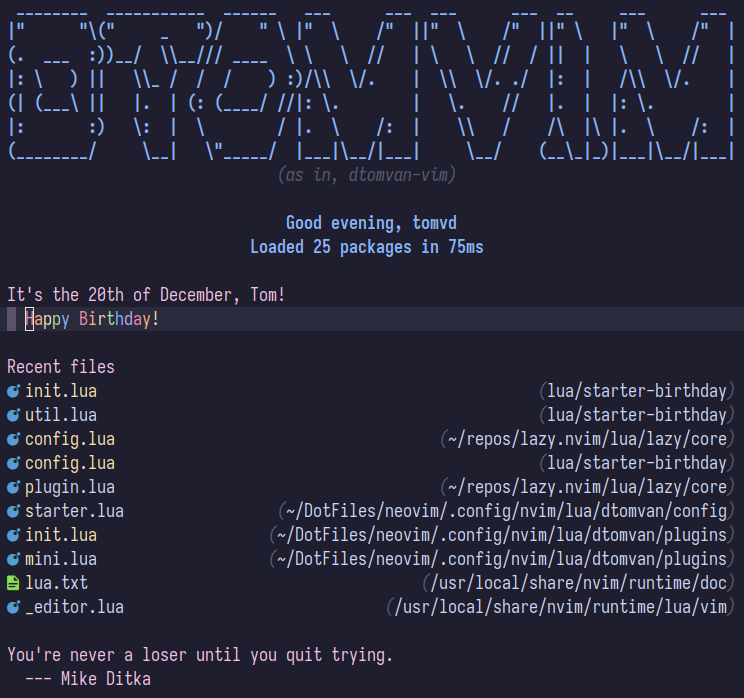

# :tada: starter-birthday.nvim

A component (and fun easter egg) for (for now only) [mini.starter](https://github.com/echasnovski/mini.nvim/blob/main/README.md) to display a happy-birthday message when you have your birthday.



## Table of Contents

- [Features](#features)
- [Requirements](#requirements)
- [Compatibility](#compatibility)
- [Installation](#installation)
- [Configuration](#configuration)
- [Usage](#usage)
- [API](#api)

## Features

- :abc: Display a "Happy Birthday"-message on a set date
- :rainbow: Display the text in rainbow
- :space_invader: Show an ASCII-art birthday card to the user

<hr/>

[Back to top](#tada-starter-birthdaynvim)

## Requirements

- :pencil2: Neovim >= `0.5.0` or nightly (probably. TODO: bisect exact minimum required
  commit)
- :dash: A dashboard plugin

<hr/>

[Back to top](#tada-starter-birthdaynvim)

## Compatibility

<details>
<summary>Guide</summary>
- :heavy_check_mark: = Working
- :construction: = WIP
- :clock1030: = Planned
</details>

| Plugin         | Status             |
| -------------- | ------------------ |
| mini.starter   | :heavy_check_mark: |
| dashboard-nvim | :clock1030:        |
| startup.nvim   | :clock1030:        |

<hr/>

[Back to top](#tada-starter-birthdaynvim)

## Installation

Using your favourite package manager:

- packer.nvim

```lua
require('packer').startup(function(use)
    use {
        'echasnovski/mini.nvim',
        requires = { 'dtomvan/starter-birthday.nvim' },
        branch = 'stable',
        config = function()
            require('starter-birthday').setup {
                -- Any options go here
            }
        end
    }
end)
```

- lazy.nvim

```lua
-- For example in plugins/starter.lua, see https://github.com/folke/lazy.nvim#-structuring-your-plugins
return {
    {
        'echasnovski/mini.nvim',
        version = '*',
        dependencies = {
            'dtomvan/starter-birthday.nvim',
            version = '^0.1',
            opts = {
                -- Any options go here
            },
        },
    },
}
```

<hr/>

[Back to top](#tada-starter-birthdaynvim)

## Configuration

The default values are:

```lua
---@type StarterBirthday.Config
{
    ---- Required values. If you want to get up and running quickly, just set
    ---- these and you're good to go!

    -- If any key in `date` is `nil`, it will ask you to configure it
    date = {
        -- number|nil defines which day of the month your birthday is on
        day = nil,
         -- number|nil defines which month of the year your birthday is on
        month = nil,
    },

    ---- Optional values. These are more intricate and typically not needed for
    ---- a good experience

    -- string|nil how the default formatters will call you, if nil then it will
    -- try $USER
    username = nil,

    -- string|nil if string, then used in the default section name (or in your
    -- own) to format the month as that locale's full month name (%B)
    locale = nil,

    -- boolean wether to always wish you a happy birthday, even if it isn't the
    -- date that was configured
    demo = false,

    item = {
        -- fun(config: BirthdayConfig): string|nil or string|nil
        -- item's name in mini.starter, if function then it will display the
        -- return value
        name = 'Happy Birthday!',
        -- Section name the item is under, handled the same as `name`
        -- Default: It's the <day>(st|nd|th) of <month>, <username>!
        section = StarterBirthday.section_name,
        rainbow = {
            -- boolean display message with rainbow coloring?
            enabled = true,
            -- table the hl_groups (in order) which make for a rainbow
            hl_groups = {
                -- NOTE: The default highlighting groups are all Neovim built-in
                -- but depending on your colorscheme it might not display accurately
                'Error',
                'Float',
                'WarningMsg',
                'String',
                'Function',
                'Exception',
            },
        },
    },
    -- gets displayed when user opens the birthday entry on the dashboard.
    ascii_art = {
        -- boolean enable action?
        enabled = true,
        -- table|string the ASCII art (or any message) to display in a new
        -- buffer
        --
        -- string: split by newline, see table
        -- table: pass directly to `nvim_buf_set_lines`
        -- Pro tip: read a file in your `~/.config/nvim` to a string
        -- For the default: see `lua/starter-birthday/ascii_art.lua`
        text = require('starter-birthday.ascii_art'),
        -- options set in buffer before writing message
        -- see `:h vim.opt_local`
        opts = {
            filetype = 'text',
            number = false,
            relativenumber = false,
            cursorline = false,
        },
    },
}
```

<hr/>

[Back to top](#tada-starter-birthdaynvim)

## Usage

```lua
-- Somewhere after the configuring this plugin
-- now the StarterBirthday global table is available.
local starter = require('mini.starter')
local bd = StarterBirthday

starter.setup {
    items = {
        -- TODO: Add support for other dashboard plugins
        bd.items['mini.starter'] {
            -- You can also pass extra configuration options here to override
            -- the "global" settings, since `mini.starter` has support for that
            --
            -- NOTE: Overriding the `rainbow` option will have no effect, as it
            -- only gets handled in the `content_hook`
        },
        -- Any other items go here
    }
    content_hooks = {
        -- Please add this content hook as early as possible, to prevent any
        -- clashing between them. Put it before hooks like:
        -- `MiniStarter.gen_hook.adding_bullet`
        --
        -- You can override the `rainbow` option here with `true` or `false`
        bd.gen_hook['mini.starter'](true),
    }
}

-- For more information on how MiniStarter is configured, visit
-- https://github.com/echasnovski/mini.nvim/blob/main/readmes/mini-starter.md
-- Or refer to `:h MiniStarter`
```

<hr/>

[Back to top](#tada-starter-birthdaynvim)
